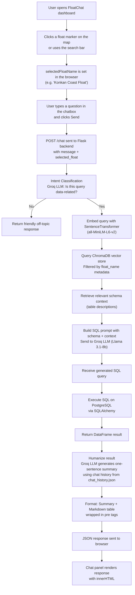
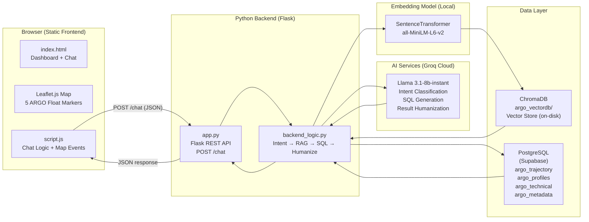

# 🌊 OceanoGraphic Chatbot — FloatChat

> **Ask questions about the ocean. Get real answers from real data.**

FloatChat is an AI-powered chatbot that makes raw oceanographic data from ARGO floats accessible through natural language. Instead of requiring users to write SQL or parse complex NetCDF scientific files, FloatChat lets anyone ask plain-language questions — _"What was the water temperature at different depths?"_ — and instantly receive structured data and a clear human-readable summary.

Built as part of **Smart India Hackathon 2024 (SIH2)** by team **TechStack**.


---

## Table of Contents

1. [Project Overview](#project-overview)
2. [Features](#features)
3. [How It Works](#how-it-works)
4. [Architecture](#architecture)
5. [Technology Stack](#technology-stack)
6. [Project Structure](#project-structure)
7. [Prerequisites](#prerequisites)
8. [Installation](#installation)
9. [Environment Variables](#environment-variables)
10. [Database Setup](#database-setup)
11. [Running the Project](#running-the-project)
12. [Usage](#usage)
13. [API Documentation](#api-documentation)
14. [UI / User Interface](#ui--user-interface)
15. [Configuration](#configuration)
16. [Available Scripts](#available-scripts)
17. [Development Guide](#development-guide)
18. [Troubleshooting](#troubleshooting)
19. [Contributing](#contributing)
20. [Project Status](#project-status)
21. [Team](#team)

---

## Project Overview

Thousands of robotic **ARGO floats** drift through the world's oceans, continuously collecting critical measurements — temperature, salinity, pressure, and geographic position — at various depths. This data is vital for climate research, but it is stored in complex binary **NetCDF (.nc)** files and requires technical knowledge to query.

**FloatChat solves this by:**

- Processing raw ARGO NetCDF data through a cleaning pipeline that loads it into a relational database
- Using a **RAG (Retrieval-Augmented Generation)** pipeline to translate natural language questions into precise SQL queries
- Presenting results as both a structured data table and a single, clear human-language summary
- Providing a context-aware map interface where users can click on a float's location and chat specifically about that float's data

**Target users:** Oceanographers, climate researchers, students, science communicators, and anyone curious about ocean data — no SQL or data science skills required.

---

## Features

### 🤖 Natural Language to SQL (Text-to-SQL via RAG)
Users type questions in plain English. The backend uses an LLM (Llama 3.1 via Groq) to generate a valid SQL query from the question. A vector store (ChromaDB) is queried first to retrieve relevant schema context, making the SQL generation accurate without hallucinations about table names or column structures.

### 🗺️ Interactive ARGO Float Map
An embedded Leaflet.js map displays the positions of five Indian ocean ARGO floats along the Indian coastline. Users can click on any float marker to zoom in and automatically set the chat context to that specific float, so all subsequent questions are scoped to that float's data.

### 🔍 Float-Scoped Context Chatting
When a float is selected (either by clicking on the map or using the search bar), all chat queries are automatically filtered to that float's data using ChromaDB metadata filtering. This prevents cross-float data confusion and makes answers more precise.

### 🧠 Intent Classification
Before attempting to query the database, the backend uses the LLM to classify whether the user's question is actually about ocean/database data or is just a greeting or off-topic message. This prevents unnecessary database calls and provides friendly fallback responses.

### 📊 Humanized Data Responses
Raw query results (up to 10 rows) are returned as a formatted table, accompanied by an LLM-generated one-sentence natural language summary that directly answers the user's question. Chat history from `chat_history.json` is included in the summarization prompt to maintain conversational context.

### 🌐 Search Autocomplete for Floats
A search bar on the dashboard lets users type the name of a float region. A dropdown autocomplete list filters the available floats in real time. Selecting a result flies the map to that float and sets it as the chat context.

### 🎨 Glassmorphism Chat UI with SVG Displacement
The FloatChat panel uses a custom SVG-filter-based glass effect — dynamically generated displacement maps — that creates a frosted glass appearance on the chat overlay, with a graceful fallback for unsupported browsers.

### 🔄 3-Stage Data Ingestion Pipeline
A standalone Python script (`Convert_and_Filter.py`) handles the full ETL (Extract, Transform, Load) workflow:
1. Converts raw ARGO **NetCDF files** to CSV using `xarray`
2. Cleans and splits the data into trajectory, profile, technical, and metadata datasets
3. Loads cleaned CSVs into a **PostgreSQL** database via `SQLAlchemy`

### 🗂️ Persistent Vector Store
`vector_store.py` builds and persists a ChromaDB vector database pre-populated with semantic descriptions of each database table, tagged with float-specific metadata. This powers the context retrieval step in the RAG pipeline.

---

## How It Works



---

## Architecture

The system is composed of two main parts: a static **web frontend** and a **Python Flask backend**.



### Component Breakdown

| Component | Technology | Role |
|---|---|---|
| **Frontend** | HTML, CSS, JavaScript | Dashboard, chat UI, interactive map |
| **Map** | Leaflet.js + OpenStreetMap | Displays ARGO float positions, handles click events |
| **Backend API** | Flask + Flask-CORS | Exposes the `/chat` POST endpoint |
| **Intent Classifier** | Groq (Llama 3.1-8b-instant) | Decides if the query is data-related |
| **Vector Store** | ChromaDB (PersistentClient) | Stores table schema descriptions as embeddings |
| **Embedding Model** | `all-MiniLM-L6-v2` (local) | Encodes queries for semantic search |
| **SQL Generator** | Groq (Llama 3.1-8b-instant) | Translates natural language to PostgreSQL SQL |
| **Database** | PostgreSQL on Supabase | Stores ARGO float oceanographic data |
| **Result Humanizer** | Groq (Llama 3.1-8b-instant) | Turns raw tabular data into a readable sentence |
| **Data Pipeline** | xarray, pandas, SQLAlchemy | Converts NetCDF → CSV → PostgreSQL |

---

## Technology Stack

| Category | Technology | Purpose |
|---|---|---|
| **Frontend** | HTML5, CSS3, JavaScript (ES6+) | Web interface, chat panel, animations |
| **Mapping** | Leaflet.js, OpenStreetMap | Interactive float location map |
| **Fonts** | Google Fonts (Inter) | Typography |
| **Backend** | Python 3, Flask 3.1 | REST API server |
| **CORS** | Flask-CORS | Allows browser to call the local API |
| **LLM API** | Groq (Llama 3.1-8b-instant) | Intent classification, SQL generation, summarization |
| **Vector Database** | ChromaDB (persistent, on-disk) | RAG schema context retrieval |
| **Embeddings** | SentenceTransformers (`all-MiniLM-L6-v2`) | Query and document embedding |
| **Relational DB** | PostgreSQL (hosted on Supabase) | Oceanographic data storage |
| **ORM / DB Driver** | SQLAlchemy 2.0, psycopg2-binary | Database connection and query execution |
| **Data Processing** | pandas, xarray | NetCDF parsing, CSV cleaning, DataFrame manipulation |
| **Config** | python-dotenv | Environment variable loading |

---

## Project Structure

```
OceanoGraphic-Chatbot/
│
├── SIH2/
│   ├── ChatBot/                   # Python backend
│   │   ├── app.py                 # Flask application & /chat endpoint
│   │   ├── backend_logic.py       # Core RAG pipeline (intent → SQL → humanize)
│   │   ├── Convert_and_Filter.py  # NetCDF → CSV → PostgreSQL data pipeline
│   │   ├── vector_store.py        # ChromaDB vector store builder
│   │   └── .gitignore             # Excludes .env and CSV files
│   │
│   └── Web/                       # Static frontend
│       ├── index.html             # Main dashboard (map + FloatChat)
│       ├── script.js              # Chat logic, map events, glass effect, canvas waves
│       ├── styles.css             # Main styles (dark ocean theme)
│       ├── about.html             # Team / about page
│       ├── about.css              # About page styles
│       ├── explore.html           # Ocean facts & insights page
│       ├── explore.css            # Explore page styles
│       ├── map.html               # Standalone map prototype
│       ├── FloatChat Logo.jpg     # Chatbot brand logo
│       └── TeckStack Logo.png     # Team logo
│
├── argo_vectordb/                 # Persisted ChromaDB vector store (auto-generated)
│   └── chroma.sqlite3
│
├── chat_history.json              # Persisted chat history for LLM context
├── .gitignore
└── README.md
```

> **Note:** The `argo_vectordb/` directory is auto-generated by `vector_store.py` and should not be manually edited. The `chat_history.json` file stores past interactions to give the LLM conversation context.

---

## Prerequisites

Before running this project locally, ensure you have the following installed:

- **Python 3.10+**
- **pip** (Python package manager)
- A **Groq API key** — free tier available at [console.groq.com](https://console.groq.com)
- A modern web browser (Chrome or Edge recommended; the glass effect uses SVG displacement filters not supported in Safari/Firefox)
- **PostgreSQL access** — the project connects to a hosted Supabase PostgreSQL instance (credentials provided via environment variables)

---

## Installation

### 1. Clone the Repository

```bash
git clone https://github.com/Aditya-londhe-77/OceanoGraphic-Chatbot.git
cd OceanoGraphic-Chatbot
```

### 2. Install Python Dependencies

Navigate to the ChatBot directory and install the required packages:

```bash
cd SIH2/ChatBot
pip install flask flask-cors groq chromadb sentence-transformers pandas sqlalchemy psycopg2-binary python-dotenv xarray
```

---

## Environment Variables

The backend requires one environment variable. Create a `.env` file inside `SIH2/ChatBot/`:

```bash
# SIH2/ChatBot/.env
GROQ_API_KEY=your_groq_api_key_here
```

> ⚠️ **Never commit your `.env` file.** It is already listed in `.gitignore`. Never expose your Groq API key in code or public repositories.

| Variable | Description |
|---|---|
| `GROQ_API_KEY` | Your Groq Cloud API key, used for LLM inference (intent classification, SQL generation, result humanization) |

---

## Database Setup

The project uses a **PostgreSQL database hosted on Supabase**. The database connection string is configured inside `backend_logic.py`.

### Database Tables

The database contains four tables, populated by the data ingestion pipeline:

| Table | Columns | Description |
|---|---|---|
| `argo_trajectory` | `N_MEASUREMENT`, `LATITUDE`, `LONGITUDE` | Geographic position of the float over time |
| `argo_profiles` | `N_MEASUREMENT`, `PRES`, `TEMP`, `PSAL` | Oceanographic measurements at depth (pressure, temperature, salinity) |
| `argo_technical` | `TECHNICAL_PARAMETER_NAME`, `TECHNICAL_PARAMETER_VALUE`, `CYCLE_NUMBER` | Operational/technical logs per cycle |
| `argo_metadata` | `PLATFORM_NUMBER`, `PROJECT_NAME`, `PI_NAME`, `LAUNCH_DATE`, `FLOAT_SERIAL_NO`, `SENSOR_MODEL`, `FIRMWARE_VERSION` | Float identification and configuration |

### Running the Data Ingestion Pipeline (Optional)

If you have the raw ARGO NetCDF files (`6902746_tech.nc`, `6902746_meta.nc`, `6902746_traj.nc`), you can re-populate the database:

```bash
cd SIH2/ChatBot
python Convert_and_Filter.py
```

This runs the 3-stage pipeline:
1. **Stage 1:** Converts NetCDF files → raw CSVs in `TempCsvData/`
2. **Stage 2:** Cleans and splits data → processed CSVs in `CleanData/`
3. **Stage 3:** Loads all CSVs into the PostgreSQL database

### Building the Vector Store (Optional)

To recreate the ChromaDB vector store with table schema embeddings:

```bash
cd SIH2/ChatBot
python vector_store.py
```

This creates the `argo_vectordb/` directory containing the persisted ChromaDB collection.

---

## Running the Project

The project has two parts: the Python Flask backend and the static HTML frontend.

### Step 1 — Start the Flask Backend

```bash
cd SIH2/ChatBot
python app.py
```

The backend will start at `http://127.0.0.1:5000`.

### Step 2 — Open the Frontend

Open `SIH2/Web/index.html` directly in your web browser.

> The frontend communicates with the backend at `http://127.0.0.1:5000/chat`. Both must be running simultaneously.

---

## Usage

1. **Open the dashboard** — Open `SIH2/Web/index.html` in your browser.
2. **Explore the map** — The interactive map loads centered on the Indian Ocean with 5 ARGO float markers visible.
3. **Select a float** — Click on any float marker on the map (e.g., the Konkan Coast Float). The map will fly to that location, the FloatChat panel will open, and a system notification confirms the selected float context.
4. **Open FloatChat** — Click the **FloatChat** button in the top bar if the chat panel is not already open.
5. **Ask a question** — Type a natural language question about ocean data, for example:
   - _"What are the top 5 highest temperature readings?"_
   - _"Show me the latitude and longitude of recent measurements."_
   - _"What is the lowest salinity recorded?"_
   - _"What is the launch date of this float?"_
6. **Receive the answer** — FloatChat responds with a one-sentence summary followed by a formatted data table.
7. **Search for a float** — Use the search bar in the top bar to type a coastline name (e.g., "Malabar") and select from the autocomplete dropdown to change the active float.

---

## API Documentation

The backend exposes a single REST endpoint.

### `POST /chat`

Processes a user's natural language query and returns a structured response.

| Method | Endpoint | Description | Authentication |
|---|---|---|---|
| `POST` | `/chat` | Submit a chat message and receive an AI-generated response with data | None |

**Request Body:**

```json
{
  "message": "What is the highest temperature recorded?",
  "selected_float": "Konkan Coast Float"
}
```

| Field | Type | Required | Description |
|---|---|---|---|
| `message` | `string` | ✅ Yes | The user's natural language question |
| `selected_float` | `string` | ❌ Optional | The name of the ARGO float to scope the query to |

**Success Response (200 OK):**

```json
{
  "response": "The highest temperature reading recorded is 30.297°C.\n\nData I found:\n<pre>| N_MEASUREMENT | TEMP |\n|---:|---:|\n| 5412 | 30.297 |</pre>"
}
```

**Error Response (400 Bad Request):**

```json
{
  "error": "No message provided"
}
```

---

## UI / User Interface

### Dashboard (`index.html`)
The main page features a dark ocean-themed design. It includes:
- An **animated header** with a wave effect that follows the mouse cursor
- A **search bar** for filtering float names with autocomplete
- A **FloatChat button** to open the chatbot overlay
- An **embedded Leaflet.js map** showing 5 ARGO float positions along the Indian coast
- A **"Follow a Float's Journey"** section with an animated canvas ocean simulation and a step-by-step narrative
- A **"From Deep Ocean to Your Screen"** feature overview section

### FloatChat Panel
A floating overlay with a glassmorphism (frosted-glass) aesthetic. It contains:
- A header with the FloatChat logo and a close button
- A scrollable message history area with distinct styling for user and bot messages
- A text input field and Send button (also triggered by Enter key)
- A typing indicator ("thinking" animation) while waiting for a response

### About Page (`about.html`)
Introduces the TechStack team with member photos, names, and roles.

### Explore Page (`explore.html`)
A static informational page about ocean science topics including ocean currents, marine biodiversity, climate impact, and key global ocean statistics.

---

## Configuration

| Setting | Location | Value | Description |
|---|---|---|---|
| `GROQ_API_KEY` | `.env` file | `your_key_here` | Groq LLM API key |
| `DB_CONNECTION_STRING` | `backend_logic.py` | PostgreSQL connection URL | Supabase PostgreSQL connection |
| `CHROMA_DB_PATH` | `backend_logic.py` | `argo_vectordb` | Path to persisted ChromaDB directory |
| `COLLECTION_NAME` | `backend_logic.py` | `argo_tables_schema` | ChromaDB collection name |
| `EMBEDDING_MODEL` | `backend_logic.py` | `all-MiniLM-L6-v2` | SentenceTransformer model |
| `CHAT_HISTORY_FILE` | `backend_logic.py` | `chat_history.json` | Path to conversation history JSON |
| Backend Port | `app.py` | `5000` | Flask development server port |
| Backend Host | `app.py` | `127.0.0.1` | Flask server bind address |
| Frontend API URL | `script.js` | `http://127.0.0.1:5000/chat` | URL the browser uses to call the backend |

---

## Available Scripts

| Script | Command | Description |
|---|---|---|
| **Start Backend** | `python app.py` | Starts the Flask development server on port 5000 |
| **Data Pipeline** | `python Convert_and_Filter.py` | Runs the full NetCDF → CSV → PostgreSQL ingestion pipeline |
| **Build Vector Store** | `python vector_store.py` | Creates/recreates the ChromaDB vector store with schema embeddings |

---

## Development Guide

| Area | Location |
|---|---|
| **Backend API** | `SIH2/ChatBot/app.py` — Flask routes and CORS setup |
| **AI/RAG Pipeline** | `SIH2/ChatBot/backend_logic.py` — Intent classification, SQL generation, result humanization |
| **Vector Store** | `SIH2/ChatBot/vector_store.py` — ChromaDB schema document setup |
| **Data Pipeline** | `SIH2/ChatBot/Convert_and_Filter.py` — NetCDF → CSV → DB ETL |
| **Frontend Logic** | `SIH2/Web/script.js` — Chat, map, glass effect, canvas animation |
| **Main UI** | `SIH2/Web/index.html` + `styles.css` — Dashboard layout and styles |
| **Environment Config** | `SIH2/ChatBot/.env` — API keys (must be created manually) |

**Making changes:**

1. Backend changes take effect immediately in `debug=True` mode (Flask auto-reloads).
2. Frontend changes are immediately visible on browser refresh (no build step required).
3. If you modify the vector store documents in `vector_store.py`, re-run `python vector_store.py` to rebuild the ChromaDB collection.
4. If you add new ARGO float data, update the `oceanFloats` array in `script.js` and add a corresponding entry to the `documents` and `metadatas` arrays in `vector_store.py`.

---

## Troubleshooting

**`ValueError: GROQ_API_KEY not found`**
- Ensure a `.env` file exists in `SIH2/ChatBot/` containing `GROQ_API_KEY=your_key_here`.
- Make sure you have installed `python-dotenv` and that the working directory is `SIH2/ChatBot/` when running `python app.py`.

**`ModuleNotFoundError` when starting the backend**
- Run `pip install flask flask-cors groq chromadb sentence-transformers pandas sqlalchemy psycopg2-binary python-dotenv xarray` to install all dependencies.

**`Failed to create database engine` on startup**
- The database connection string in `backend_logic.py` points to the Supabase instance. Verify network access to Supabase is available. If deploying your own database, update `DB_CONNECTION_STRING`.

**Chat responds "Sorry, I'm having trouble connecting..."**
- Ensure the Flask backend is running (`python app.py`) before opening the frontend. The browser communicates with `http://127.0.0.1:5000/chat`.

**Port 5000 already in use**
- Change the port in `app.py` (`app.run(port=XXXX)`) and update the corresponding URL in `script.js`.

**ChromaDB collection not found error**
- Run `python vector_store.py` from within the `SIH2/ChatBot/` directory to create the `argo_vectordb` collection.

**Glass effect not appearing on the chat panel**
- The SVG displacement filter used for the glass effect requires Chromium-based browsers (Chrome, Edge). Firefox and Safari are not supported and will fall back to a standard appearance.

---

## Contributing

1. **Fork** the repository on GitHub
2. **Clone** your fork locally: `git clone https://github.com/YOUR_USERNAME/OceanoGraphic-Chatbot.git`
3. **Create a feature branch**: `git checkout -b feature/your-feature-name`
4. **Make your changes** in the appropriate files
5. **Test your changes** by running the backend and verifying responses in the browser
6. **Commit your changes**: `git commit -m "feat: describe your change"`
7. **Push the branch**: `git push origin feature/your-feature-name`
8. **Open a Pull Request** on the original repository with a clear description of what you changed

> ⚠️ Never commit your `.env` file or any API credentials. Ensure `SIH2/ChatBot/.env` is in your `.gitignore` before committing.

---

## Project Status

**🔬 Prototype / Hackathon Build**

This project was built for Smart India Hackathon 2024. It is a functional prototype demonstrating an end-to-end AI-powered oceanographic data chatbot. The Konkan Coast Float (ARGO float `6902746`) is the primary dataset loaded into the database.

---

## Team

Built by **TechStack** for **Smart India Hackathon 2024 (SIH2)**.

| Name | Role |
|---|---|
| **Aman Singh** | UI/UX & Backend |
| **Aditya Londhe** | Backend |
| **Varad Kanhere** | UI/UX |
| **Aasawari Lakhe** | Team Member |
| **Aarya Sardeshpande** | FIGMA / Design |
| **Krish Makariye** | Team Member |

---

<p align="center">
  Made with 🌊 by TechStack &nbsp;|&nbsp; Smart India Hackathon 2024
</p>
